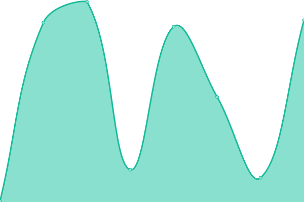
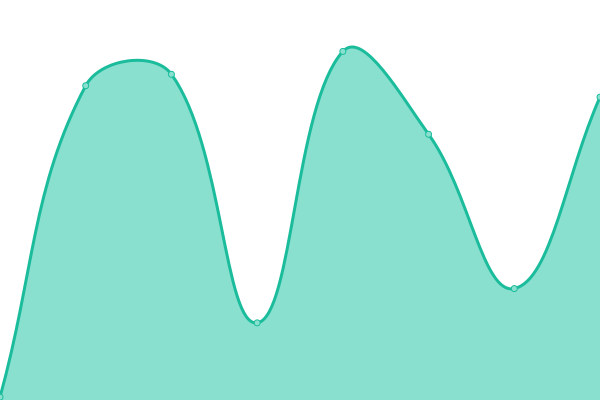

# [📈 Live Status](https://cjpelaezrivas.github.io/prlazarus-upptime): <!--live status--> **🟩 All systems operational**

This repository contains the open-source uptime monitor and status page for [Carlos J. Peláez Rivas](https://cjpelaezrivas.github.io), powered by [Upptime](https://github.com/upptime/upptime).

With [Upptime](https://upptime.js.org), you can get your own unlimited and free uptime monitor and status page, powered entirely by a GitHub repository. We use [Issues](https://github.com/cjpelaezrivas/prlazarus-upptime/issues) as incident reports, [Actions](https://github.com/cjpelaezrivas/prlazarus-upptime/actions) as uptime monitors, and [Pages](https://cjpelaezrivas.github.io/prlazarus-upptime) for the status page.

<!--start: status pages-->
<!-- This summary is generated by Upptime (https://github.com/upptime/upptime) -->
<!-- Do not edit this manually, your changes will be overwritten -->
<!-- prettier-ignore -->
| URL | Status | History | Response Time | Uptime |
| --- | ------ | ------- | ------------- | ------ |
|  [cjpelaezrivas.github.io](https://cjpelaezrivas.dev/) | 🟩 Up | [cjpelaezrivas-github-io.yml](https://github.com/cjpelaezrivas/prlazarus-upptime/commits/HEAD/history/cjpelaezrivas-github-io.yml) | 

 889ms
     
 | 

<a href="https://cjpelaezrivas.github.io/prlazarus-upptime/history/cjpelaezrivas-github-io">100.00%</a>
    

|  [prLázarus](https://prlazarus.es/) | 🟩 Up | [pr-lazarus.yml](https://github.com/cjpelaezrivas/prlazarus-upptime/commits/HEAD/history/pr-lazarus.yml) | 

 470ms
     
 | 

<a href="https://cjpelaezrivas.github.io/prlazarus-upptime/history/pr-lazarus">100.00%</a>
    

|  [Project blip](https://cjpelaezrivas.dev/ProjectBlip) | 🟩 Up | [project-blip.yml](https://github.com/cjpelaezrivas/prlazarus-upptime/commits/HEAD/history/project-blip.yml) | 

 140ms
     
 | 

<a href="https://cjpelaezrivas.github.io/prlazarus-upptime/history/project-blip">100.00%</a>
    

|  [Lighthouse](https://cjpelaezrivas.dev/Lighthouse/) | 🟩 Up | [lighthouse.yml](https://github.com/cjpelaezrivas/prlazarus-upptime/commits/HEAD/history/lighthouse.yml) | 

 97ms
     
 | 

<a href="https://cjpelaezrivas.github.io/prlazarus-upptime/history/lighthouse">100.00%</a>
    

<!--end: status pages-->

[**Visit our status website →**](https://cjpelaezrivas.github.io/prlazarus-upptime)

## 📄 License

- Powered by: [Upptime](https://github.com/upptime/upptime)
- Code: [MIT](./LICENSE) © [Anand Chowdhary](https://anandchowdhary.com), supported by [Pabio](https://pabio.com)
- Data in the `./history` directory: [Open Database License](https://opendatacommons.org/licenses/odbl/1-0/)
